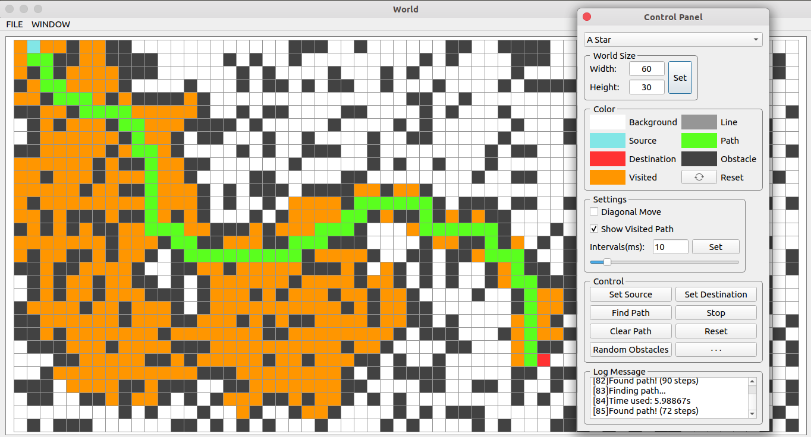
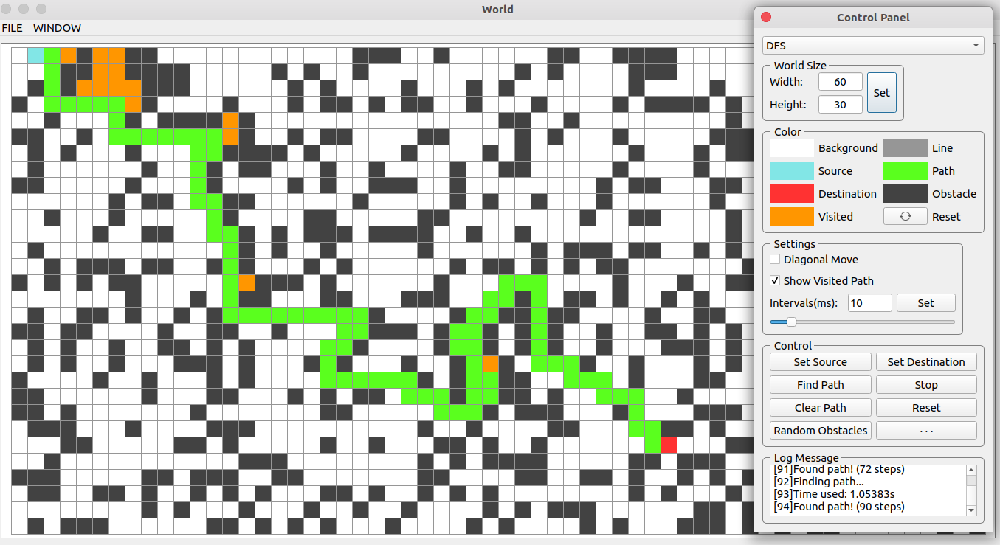

## PathFinding

+ A Star
+ B Star (with bugs!)
+ BFS
+ DFS

## 添加新算法

如果写其他算法，只需要继承自`FindPathBase`类，

并重写`std::list<Coordinate> findPath(src, dest)`函数。


例如，假设有一个新的 算法 `C Star` :

<font color="red">注意: 标有 [Required] 的地方是必须要写的 !</font>

```
class CStar : public FindPathBase
{
public:
    std::list<Coordinate> findPath(const Coordinate& src, const Coordinate& dest) {
        stopFindPath = false;  // [Required]

        // ...

        //  开始寻路
        while (...) {

            // 是否强制终止寻路, [Required]
            if (stopFindPath) {
                return {};
            }

            // ...

            // 新的点 newCoord
            Coordinate newCoord = ...;

            // 该点是障碍物
            if (detectObstace(newCoord)) {
                continue;
            }

            // 该点是目标，返回
            else if (newCoord == dest) {
                std::list<Coordinate> path;
                // add coord to path
                // ...
                return path;
            }

            else {
                // 通知GUI线程，绘制该点(已经访问的点，默认为橘色)  [Required]
                notifyVisitedCoordinate(newCoord);
                // ...
            }

            // ...
        }

        // ...
        
        return {};  // 返回空路径
    }
}
```


然后在`src/controldialog.cpp`中，将该算法添加到候选列表中

1、构造函数中，添加

`comboxFindPathList->addItem("C Star");  // 算法名称`

2、`onFindPathMethodChanged`函数中，添加

```
    else if (methodName == "C Star") {
        findPathBaseNew = new CStar();
        if (controlPanelExtend) {
            delete controlPanelExtend;
            controlPanelExtend = nullptr;
        }
        // 扩展控制面板（该算法的独有的设置项，如果没有，就忽略）
        //controlPanelExtend = new ControlPanelExtendCStar(world, nullptr);
    }
```

## Screenshots

### [1/4] A Star
 


### [2/4] BFS
 

### [3/4] DFS
 

 

### [4/4] B Star (With bugs)

Only used for obstacles

 


## END

Author: <a href="https://github.com/Leopard-C" target="_blank"> github@Leopard-C</a>

Email:  <leopard.c@outlook.com>


